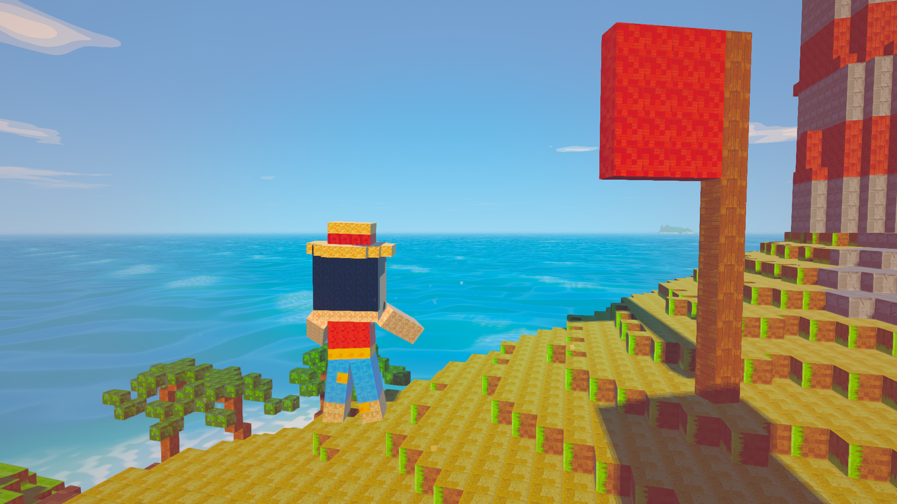
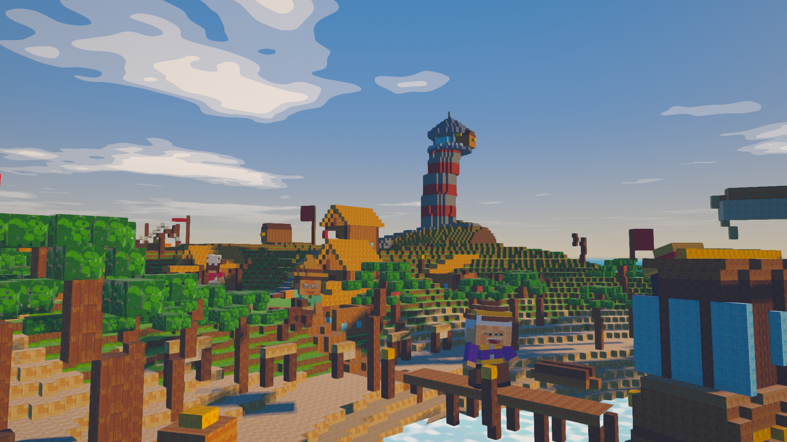
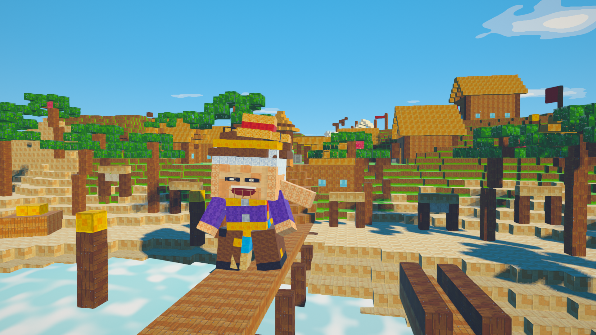
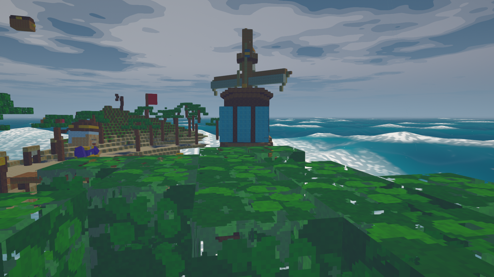
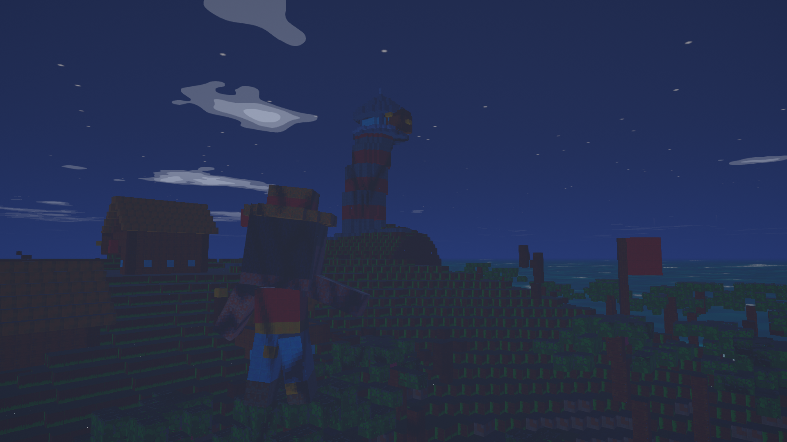
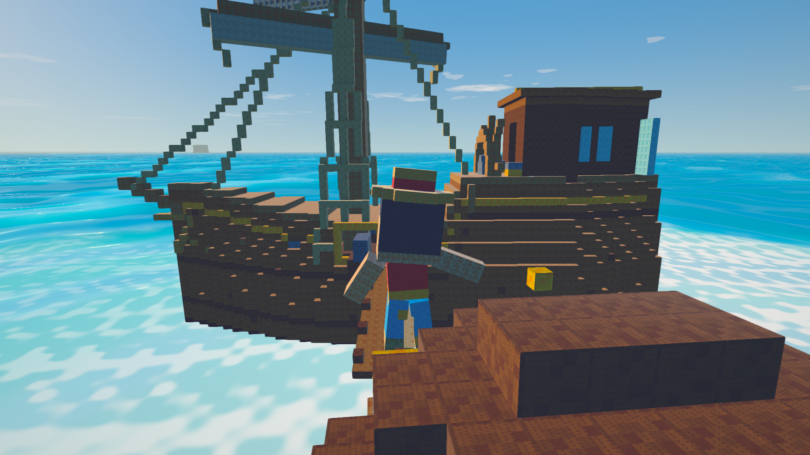
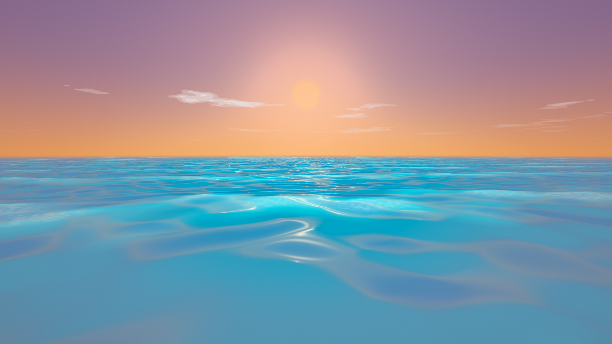
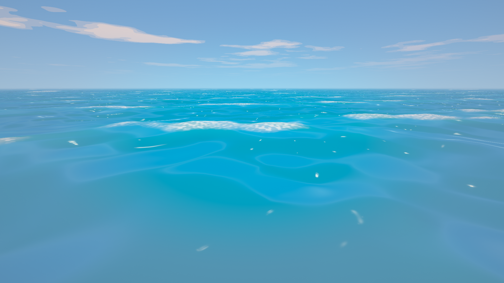

# Grand Line Voxel

A browser-based open-world voxel action game. Sail a Grand Line-scale ocean, fight, use devil
fruit powers, run quest chains. Three.js + WebGL2, no game engine.



**Every texture, mesh, animation and sound in this project is generated in code at load time.**
There are no image, audio, font or model files anywhere in the repository, and
`npm run lint:assets` fails the build if one appears. (The screenshots in this README are the
harness's own deterministic captures from `evidence/` — output, not assets.)

---

## Run it

Requirements: **Node 20+** and a browser with **WebGL2** (Chrome, Edge, Firefox, Safari 16+).
Nothing else. No backend, no accounts, no network access at runtime.

```bash
npm install
```

```bash
npm run dev
```

Then open **http://127.0.0.1:5273**. First boot takes about a second while the textures,
meshes and sounds are generated; there is a progress bar.

For a production build:

```bash
npm run build && npm run preview
```

### Controls

| | |
|---|---|
| Move | `W` `A` `S` `D` |
| Look | mouse (click the canvas once to capture the pointer) |
| Sprint | `Shift` |
| Jump | `Space` |
| Dodge | `C` |
| Attack / heavy | left mouse / right mouse |
| Block (hold) / parry (tap on impact) | `Q` |
| Devil fruit abilities | `1` `2` `3` |
| Interact / talk / board / dock | `E` |
| Raise / lower sail | `R` / `F` |
| Anchor / cast off / dock | `G` |
| Lock on | `T` |
| Swap devil fruit | `X` |
| Map / quests / crew | `M` / `J` / `K` |
| Pause, save, load, settings | `Esc` |

The first-time flow teaches all of this in play, one lesson at a time, when each control is
the thing in front of you — and holding `Tab` shows this table in-game, generated from the
live bindings. Click the canvas once to capture the mouse; the game asks on screen.

### URL parameters

| parameter | meaning |
|---|---|
| `?seed=20260814` | world seed. The same seed always produces the same world. |
| `?seed=anything` | text seeds work too; they are hashed. |
| `?drs=0` | pin native resolution (disables the dynamic-resolution scaler). |

---

## How to play

**Your first ten minutes.** You wake at the dock of **Shells Cove**. The tutorial teaches each
control the moment you need it — walk, look, fight, board, sail — and gets out of the way. Talk
to villagers with `E`; anyone with something to say will flag it. The first quest chain starts
right there in the village.

**Sailing.** Board your ship with `E`, cast off from the berth with `G`, raise the sail with
`R`, and steer with `A`/`D`. The ocean is real distance — islands are kilometres apart,
weather rolls through (clear, breezy, squall, storm), and the sea state changes how the ship
handles. Open the map with `M` to pick a heading. Near an island's dock, lower the sail
(`F`), glide in, and moor with `G` (or `E`). Your crew is visible on deck as you recruit
them — they cook, navigate, and fight for you ashore.

**Combat.** Lock on with `T`. Light attacks chain into combos; heavy attacks break guards;
enemies telegraph their swings, and a dodge (`C`) through a telegraph keeps your combo alive.
Block with `Q` — tapping it exactly on impact parries. Out of combat you regenerate health
after a few calm seconds. If you go down, you wake at the nearest safe point; the world doesn't
reset.

**Devil fruits.** Each landmark island's quest chain ends in a devil fruit — acquiring power
*is* the progression curve. Six fruits, mechanically distinct, on `1` `2` `3` (swap sets with
`X`):

| fruit | island chain | what it does |
|---|---|---|
| **Gomu** (rubber) | Shells Cove | stretch strikes, gatling flurry, slingshot launch and zip |
| **Mera** (fire) | Palm Reach | fire pillars, burn damage over time, flame-powered air dashes — rain smothers the flame |
| **Hie** (ice) | Drum Peaks | freeze enemies solid, ice walls, walkable ice sheets over water |
| **Gura** (quake) | Emberfall | ground slams, armor-cracking shockwaves, sea-quakes |
| **Suna** (sand) | Whisper Sands | sandstorms, life drain, burrow under the battlefield |
| **Zushi** (gravity) | Blossom Terrace | pull enemies in, crush them down, gravity wells |

One warning every pirate learns the hard way: **devil fruit users cannot swim.**

**Bounty and quests.** Quests raise your bounty; your wanted poster (on the `J` journal screen)
is redrawn as it climbs, and higher bounties change how the world treats you. Chains also
recruit your crew and hand over map fragments pointing at the next landmark. There are 8
landmark islands, each hand-authored, plus generated minor islands between them.

**Saving.** `Esc` opens the pause menu — three save slots, stored locally in your browser. A
save records the seed plus everything you changed; reload restores position, bounty, quests,
crew, and inventory exactly.

---

## Screenshots

Deterministic captures from the harness — same seed, same pixels, every run.

| | |
|---|---|
|  |  |
| *Approaching Shells Cove under sail* | *Ashore among the huts* |
|  |  |
| *Riding out a storm* | *The island after dark* |
|  |  |
| *The captain, procedurally modelled and rigged* | *Cast lineup — every character generated in code* |
|  |  |
| *Golden hour on open water* | *Noon, full sail* |

---

## Repository layout

```
src/
  app.js            boot order, fixed-step loop, render call
  game.js           the ONLY file that knows about every system; wires them in step order
  main.js           play-mode entry
  core/             rng, clock, math, input, profiler, save
  gen/              procedural generation: palette, noise, textures, voxels, blocks,
                    character models, props, islands
  render/           renderer + render graph, sky, water, shadows, materials, camera, fx
  world/            island placement, chunk streaming, weather, spawning
  entity/           actor base, rig, animation, player, enemies, npcs
  combat/           attacks, hitboxes, telegraphs, damage
  ship/             ship model, sailing physics, docking, crew aboard
  fruit/            the six devil fruit powers
  quest/            objectives, quest chains, bounty, crew, dialogue
  ui/               procedural typeface, HUD, menus, tutorial
  audio/            synthesis toolkit, sound bank, adaptive music
tools/              the evidence harness (see below)
evidence/           generated output: screenshots, diffs, perf, reports, progress.html
reference/          ART_BAR.md — the art standard everything is judged against
```

`ARCHITECTURE.md` is the contract between systems: ownership, coordinate conventions, the
lighting contract, the save format, and the harness contract. Read it before changing anything
that crosses a module boundary.

`PROGRESS.md` is the running log: what is done, what is in flight, verdicts, failed approaches,
and the next action.

---

## The evidence harness

Nothing in this project is claimed without being measured. The tooling that does the measuring is
built first and is a first-class part of the repo.

```bash
npm run capture              # deterministic screenshots of the fixed shot list
npm run capture -- --verify  # proves two consecutive runs are bit-identical
npm run diff                 # pixel-diff gate against evidence/baseline
npm run profile              # frame-time profiler on the real GPU: p50/p95/p99 + hitch causes
npm run playtest             # scripted playtest driving real input events
npm run gate                 # every objective gate, in order, PASS/FAIL table
npm run lint:determinism     # bans Math.random / wall-clock reads in simulation code
npm run lint:assets          # bans binary assets
node tools/progress.mjs      # regenerates evidence/progress.html
```

Then open **`evidence/progress.html`** for the current state of every gate, the latest
screenshots, and the performance numbers.

Design notes that matter if you touch the harness:

- **Captures run on ANGLE/SwiftShader** (software rasterisation). That is what makes
  "bit-identical" mean something on any machine rather than being an artefact of one GPU driver.
- **Profiling runs on the real GPU.** Software timings are meaningless.
- **Every shot gets a fresh browser process, context and page.** State cannot leak between shots.
- Screenshots are read from the **WebGL backbuffer**, not the compositor, so the evidence is
  exactly what the renderer produced.
- The profiler reports **percentiles and per-hitch attribution, never averages** — averages hide
  precisely the stalls that make a game feel bad.

### Adding a shot

Add an entry to `src/shots.js`. A shot seeks the world to an exact state and frames the camera;
it must never read wall time and must never depend on a previous shot. Then:

```bash
npm run capture -- --shots your-shot-id
```

---

## The rules this codebase enforces on itself

These are checked by tooling, not by convention:

1. No downloaded assets of any kind. (`lint:assets`)
2. No `Math.random()`. All randomness flows from the world seed through named streams in
   `src/core/rng.js`, so adding a consumer never shifts an existing one. (`lint:determinism`)
3. No wall-clock reads in simulation code. Simulation time comes from `Clock.simTime`.
   (`lint:determinism`, with an explicit waiver list for boot instrumentation)
4. Fixed 1/60 s timestep. Rendering interpolates; it never mutates simulation state.
5. Zero shader compilations after boot. Everything is compiled by `Renderer.prewarm()`, and the
   capture manifest reports any program linked afterwards.
6. No colour is hardcoded outside `src/gen/palette.js`.

---

## Troubleshooting

**A black screen and `WebGL2 not supported`.** The game needs WebGL2. Check `chrome://gpu`.
Software rendering works but will be slow.

**Port 5273 already in use.** `npm run dev -- --port 5299`, or stop the other server. The capture
tool reuses an already-running dev server on 5273 if it finds one.

**`npm run capture` cannot find a browser.** It looks for a Playwright-managed Chromium first,
then a system Chrome. Install one with `npx playwright install chromium`.

**Captures differ between runs.** That is a real bug, not a flake — the whole point of the
harness. `npm run capture -- --verify` will name the shots that differ. The usual cause is new
code reading `Math.random()` or the wall clock; `npm run lint:determinism` finds it.

**Saves.** Progress lives in `localStorage` under `glv.save.v1.slot0..2`. Clearing site data
starts a new game. A save stores the seed plus what you changed — the world itself is
regenerated from the seed, never stored.
